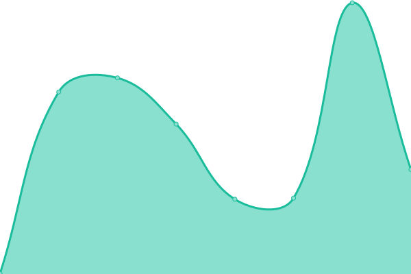

# [📈 Live Status](https://XokoukioX.github.io/KeepServiceAlive): <!--live status--> **🟩 All systems operational**

This repository contains the open-source uptime monitor and status page for [Kawakaze](https://XokoukioX.github.io/KeepServiceAlive), powered by [Upptime](https://github.com/upptime/upptime).

With [Upptime](https://upptime.js.org), you can get your own unlimited and free uptime monitor and status page, powered entirely by a GitHub repository. We use [Issues](https://github.com/XokoukioX/KeepServiceAlive/issues) as incident reports, [Actions](https://github.com/XokoukioX/KeepServiceAlive/actions) as uptime monitors, and [Pages](https://XokoukioX.github.io/KeepServiceAlive) for the status page.

<!--start: status pages-->
<!-- This summary is generated by Upptime (https://github.com/upptime/upptime) -->
<!-- Do not edit this manually, your changes will be overwritten -->
<!-- prettier-ignore -->
| URL | Status | History | Response Time | Uptime |
| --- | ------ | ------- | ------------- | ------ |
|  [QSign](https://qsign-shirasuazusa.koyeb.app/) | 🟩 Up | [q-sign.yml](https://github.com/XokoukioX/UpTimeRobot/commits/HEAD/history/q-sign.yml) | 

 193ms
     
 | 

<a href="https://XokoukioX.github.io/KeepServiceAlive/history/q-sign">99.52%</a>
    

|  [GPT_API](https://go-chatgpt-api-zyw8.onrender.com) | 🟩 Up | [gpt-api.yml](https://github.com/XokoukioX/UpTimeRobot/commits/HEAD/history/gpt-api.yml) | 

 213ms
     
 | 

<a href="https://XokoukioX.github.io/KeepServiceAlive/history/gpt-api">100.00%</a>
    

|  [Blog](https://www.kawakaze.dynv6.net/) | 🟩 Up | [blog.yml](https://github.com/XokoukioX/UpTimeRobot/commits/HEAD/history/blog.yml) | 

 5925ms
     
 | 

<a href="https://XokoukioX.github.io/KeepServiceAlive/history/blog">100.00%</a>
    

<!--end: status pages-->

[**Visit our status website →**](https://XokoukioX.github.io/KeepServiceAlive)

## 📄 License

- Powered by: [Upptime](https://github.com/upptime/upptime)
- Code: [MIT](./LICENSE) © [Anand Chowdhary](https://anandchowdhary.com), supported by [Pabio](https://pabio.com)
- Data in the `./history` directory: [Open Database License](https://opendatacommons.org/licenses/odbl/1-0/)
